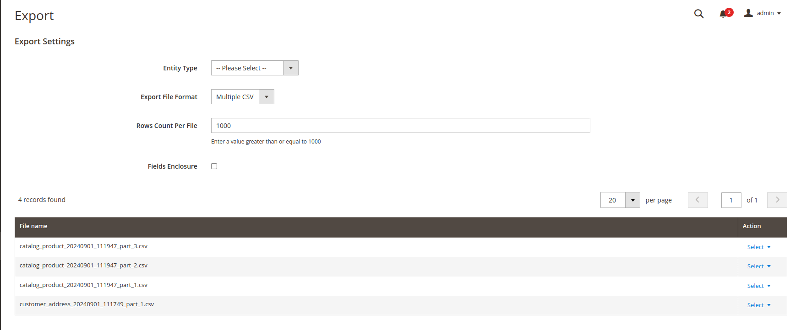

# Multiple CSV Export Adapter
Magento 2 module which help you to export data within multiple CSV

## Installation

Install Using Composer

```
composer require cwsps154/multiple-csv-export-adapter
```
Run

```
bin/magento se:up && bin/magento se:di:com && bin/magento cache:clean
```

## Screenshots


